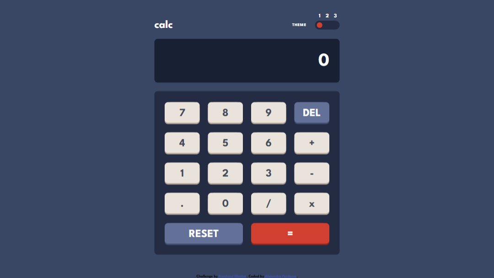

# Frontend Mentor - Calculator app solution

This is a solution to the [Calculator app challenge on Frontend Mentor](https://www.frontendmentor.io/challenges/calculator-app-9lteq5N29). Frontend Mentor challenges help you improve your coding skills by building realistic projects.

## Table of contents

- [Overview](#overview)
  - [The challenge](#the-challenge)
  - [Screenshot](#screenshot)
  - [Links](#links)
- [My process](#my-process)
  - [Built with](#built-with)
  - [What I learned](#what-i-learned)
- [Author](#author)

## Overview

### The challenge

Users should be able to:

- See the size of the elements adjust based on their device's screen size
- Perform mathmatical operations like addition, subtraction, multiplication, and division
- Adjust the color theme based on their preference
- **Bonus**: Have their initial theme preference checked using `prefers-color-scheme` and have any additional changes saved in the browser

### Screenshot

### Links

- Solution URL: [Frontend Mentor Solution](https://www.frontendmentor.io/solutions/responsive-25digit-calculator-with-theme-switch-Ru7lyo80V-)
- Live Site URL: [Calculator App](https://calculator-alejandro.netlify.app)

## My process

### Built with

- Semantic HTML5 markup
- CSS custom properties
- Flexbox
- CSS Grid
- Desktop-first workflow
- JavaScript (ES6)

### What I learned

This challenge helped me understand mathematical operations in JavaScript and how to use them to create useful applications.

## Author

- Frontend Mentor - [@Cavalry2010](https://www.frontendmentor.io/profile/Cavalry2010)
- Twitter - [@AlPerdomoMC](https://www.twitter.com/AlPerdomoMC)
- GitHub - [@Cavalry2010](https://www.github.com/Cavalry2010)
